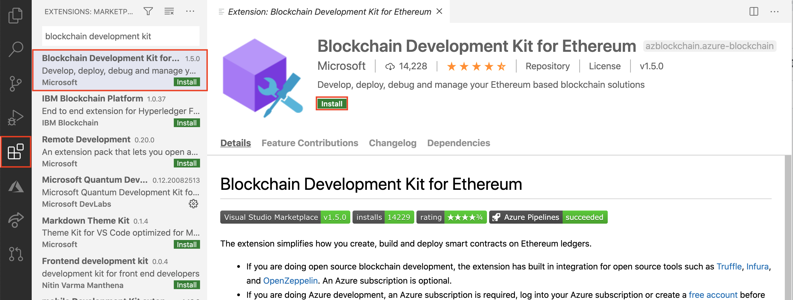

# Exercise: Install the Blockchain Development Kit for Ethereum

## Get started

[Blockchain Development Kit for Ethereum](https://marketplace.visualstudio.com/items?itemName=AzBlockchain.azure-blockchain) is an extension you can use in Visual Studio Code. The extension makes it easy to create, build, and deploy smart contracts on Ethereum ledgers.

Simply go to extensions and search for Blockchain Development Kit and install it. Make sure you have the correct system requirements before installing it.



## Dependencies to install

- Python
- Node
- Git

## Create a New Solidity Project with the extension

1. Add a new empty folder to your computer. `mkdir myproj`
Open Visual Studio Code.
2. Go to View -> Command Palette, or use ctrl+shift+P. In the search box type: Blockchain New Solidity Project
3. Use the UI file explorer pop up to find the folder you created in step1
4. If you have all the requirements needed you should be able to choose: **Create basic project**

## Compile the project

1. Go to contracts/HelloBlockchain.sol
Right click HelloBlockchain.sol
2. Click on Build Contracts to compile the smart contract
In Output you can see information about the compiled contract

## Deploy the contract locally

1. Go to contracts/HelloBlockchain.sol
2. Right click HelloBlockchain.sol
3. Click on Deploy Contracts and select local
4. In the output you can see information about the deployed contract

```solidity
contract address:    0x11c89ee4Da94151fEB1700444DE8d95F1c7E5C30
   > block number:        3
   > block timestamp:     1599552199
   > account:             0x962562e7b71529119f2fd5daeCCFcaCa98A9fC17
   > balance:             99.9845291
   > gas used:            505945 (0x7b859)
   > gas price:           20 gwei
   > value sent:          0 ETH
   > total cost:          0.0101189 ETH
```
 


Here you see some key information / meta data about the contract you just deployed:
The address of the contract (for you to interact with using a API or a frontend using web3.js … stay tuned for Module2)
Time stamp of the block that the contract creation tx was a part of
The account that deployed the contract
This contract deployment had no msg.value (value sent = 0)
Gas related settings / data and cost in Eth
